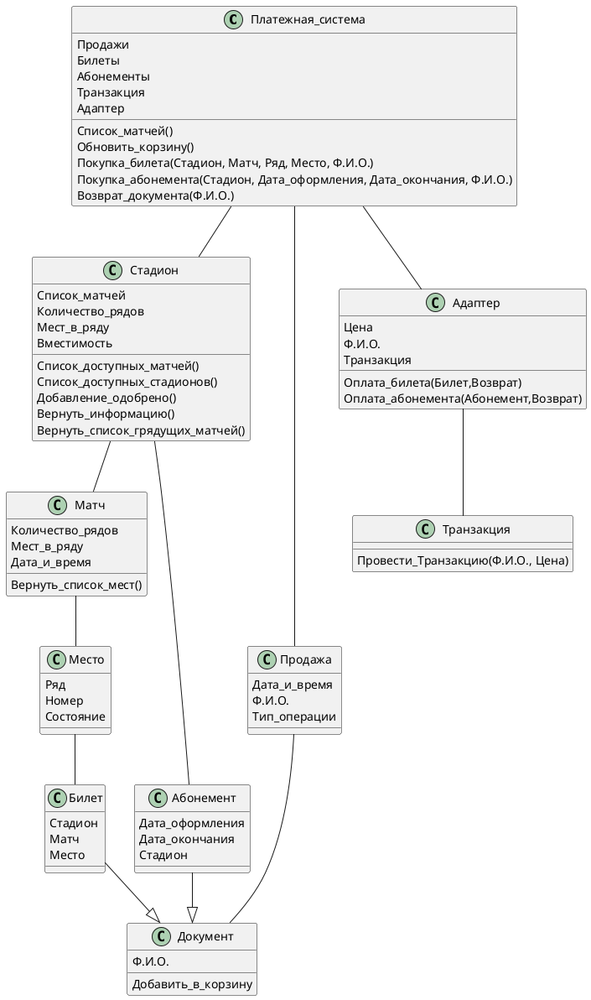

```plantuml
@startuml

class Платежная_система {
  {field} Продажи
  {field} Билеты
  {field} Абонементы
  {field} Транзакция
  {field} Адаптер
  {method} Список_матчей()
  {method} Обновить_корзину()
  {method} Покупка_билета(Стадион, Матч, Ряд, Место, Ф.И.О.)
  {method} Покупка_абонемента(Стадион, Дата_оформления, Дата_окончания, Ф.И.О.)
  {method} Возврат_документа(Ф.И.О.)
}

class Стадион {
 {field} Список_матчей
 {field} Количество_рядов
 {field} Мест_в_ряду
 {field} Вместимость
 {method} Список_доступных_матчей()
 {method} Список_доступных_стадионов()
 {method} Добавление_одобрено()
 {method} Вернуть_информацию()
 {method} Вернуть_список_грядущих_матчей()
}

class Продажа {
  {field} Дата_и_время
  {field} Ф.И.О.
  {field} Тип_операции
}

class Документ {
  {field} Ф.И.О.
  {method} Добавить_в_корзину
}


class Место {
  {field} Ряд
  {field} Номер
  {field} Состояние
}

class Матч {
  {field} Количество_рядов
  {field} Мест_в_ряду
  {field} Дата_и_время
  {method} Вернуть_список_мест()
}

class Абонемент {
  {field} Дата_оформления
  {field} Дата_окончания
  {field} Стадион
}

class Билет {
  {field} Стадион
  {field} Матч
  {field} Место
}

class Адаптер{
  {field} Цена
  {field} Ф.И.О.
  {field} Транзакция
  {method} Оплата_билета(Билет,Возврат)
  {method} Оплата_абонемента(Абонемент,Возврат)
}
class Транзакция {
  {method} Провести_Транзакцию(Ф.И.О., Цена)
}

Платежная_система -- Стадион
Стадион -- Абонемент
Стадион -- Матч
Матч --  Место
Место -- Билет
Билет --|> Документ
Абонемент --|> Документ
Платежная_система  --  Продажа
Продажа -- Документ
Платежная_система -- Адаптер
Адаптер -- Транзакция

@enduml
```
