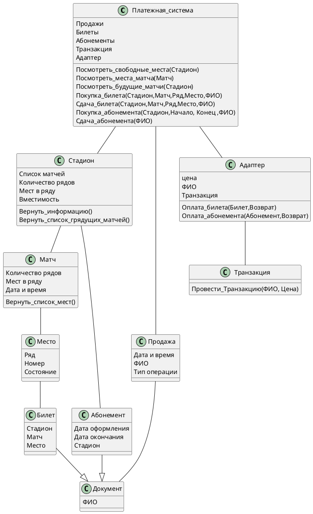

```plantuml
@startuml

class Платежная_система {
  {field} Продажи
  {field} Билеты
  {field} Абонементы
  {field} Транзакция
  {field} Адаптер
  {method} Посмотреть_свободные_места(Стадион)
  {method} Посмотреть_места_матча(Матч)
  {method} Посмотреть_будущие_матчи(Стадион)
  {method} Покупка_билета(Стадион,Матч,Ряд,Место,ФИО)
  {method} Cдача_билета(Стадион,Матч,Ряд,Место,ФИО)
  {method} Покупка_абонемента(Стадион,Начало, Конец ,ФИО)
  {method} Cдача_абонемента(ФИО) 
}

class Стадион {
 {field} Список матчей
 {field} Количество рядов
 {field} Мест в ряду
 {field} Вместимость
 {method} Вернуть_информацию()
 {method} Вернуть_список_грядущих_матчей()
}

class Продажа {
  {field} Дата и время
  {field} ФИО
  {field} Тип операции
}

class Документ {
  {field} ФИО
}

class Место {
  {field} Ряд
  {field} Номер
  {field} Состояние
}

class Матч {
  {field} Количество рядов
  {field} Мест в ряду
  {field} Дата и время
  {method} Вернуть_список_мест()
}

class Абонемент {
  {field} Дата оформления
  {field} Дата окончания
  {field} Стадион
}

class Билет {
  {field} Стадион
  {field} Матч
  {field} Место
}

class Адаптер{
  {field} цена
  {field} ФИО
  {field} Транзакция
  {method} Оплата_билета(Билет,Возврат)
  {method} Оплата_абонемента(Абонемент,Возврат)
}
class Транзакция {
  {method} Провести_Транзакцию(ФИО, Цена)
}

Платежная_система -- Стадион
Стадион -- Абонемент
Стадион -- Матч
Матч --  Место
Место -- Билет
Билет --|> Документ
Абонемент --|> Документ
Платежная_система  --  Продажа
Продажа -- Документ
Платежная_система -- Адаптер
Адаптер -- Транзакция

@enduml
```
