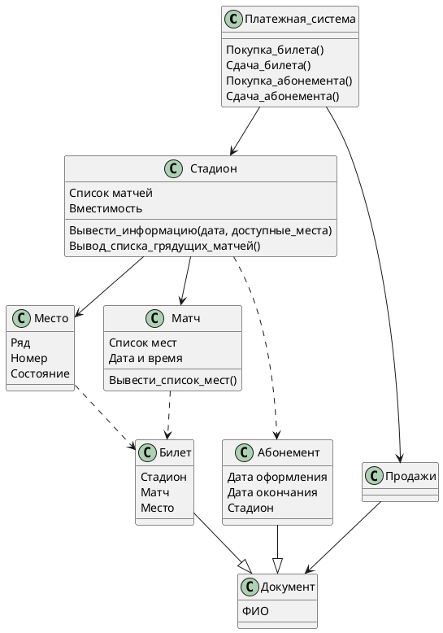

```plantuml
@startuml

class Платежная_система {
  {method} Покупка_билета()
  {method} Cдача_билета()
  {method} Покупка_абонемента()
  {method} Cдача_абонемента() 
}

class Стадион {
 {field} Список матчей
 {field} Вместимость
 {method} Вывести_информацию(дата, доступные_места)
 {method} Вывод_списка_грядущих_матчей()
}

class Продажи {
}

class Документ {
  {field} ФИО
}

class Место {
  {field} Ряд
  {field} Номер
  {field} Состояние
}

class Матч {
  {field} Список мест
  {field} Дата и время
  {method} Вывести_список_мест()
}

class Абонемент {
  {field} Дата оформления
  {field} Дата окончания
  {field} Стадион
}

class Билет {
  {field} Стадион
  {field} Матч
  {field} Место
}

Платежная_система --> Стадион
Платежная_система --> Продажи
Продажи --> Документ
Стадион --> Место
Стадион --> Матч
Билет --|> Документ
Абонемент --|> Документ
Матч ..> Билет
Место ..> Билет
Стадион ..> Абонемент

@enduml
```