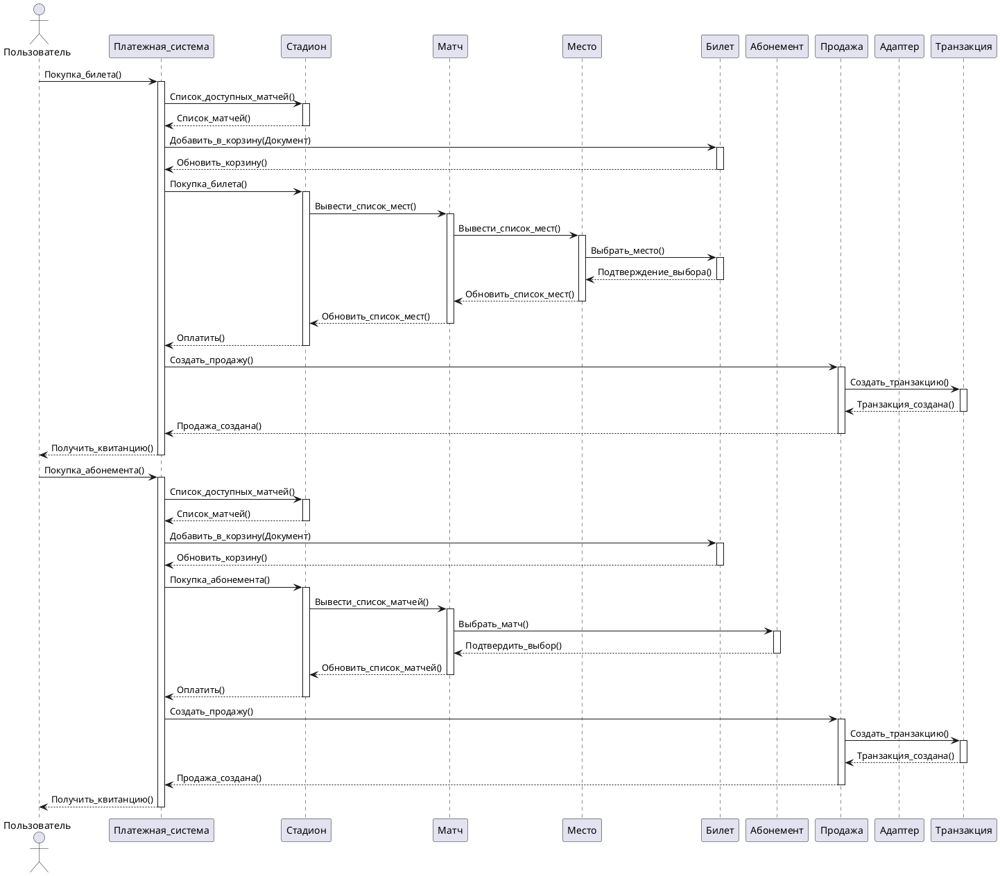

```plantuml
@startuml

actor Пользователь
participant Платежная_система
participant Стадион
participant Матч
participant Место
participant Билет
participant Абонемент
participant Продажа
participant Адаптер
participant Транзакция 

'Часть с Билетом, начало.

Пользователь -> Платежная_система: Покупка_билета()
activate Платежная_система

Платежная_система -> Стадион: Список_доступных_матчей()
activate Стадион
Стадион --> Платежная_система: Список_матчей()
deactivate Стадион
Платежная_система -> Билет: Добавить_в_корзину(Документ)
activate Билет
Билет --> Платежная_система: Обновить_корзину()
deactivate Билет

Платежная_система -> Стадион: Покупка_билета()
activate Стадион
Стадион -> Матч: Вывести_список_мест()
activate Матч
Матч -> Место: Вывести_список_мест()
activate Место
Место -> Билет: Выбрать_место()
activate Билет
Билет --> Место: Подтверждение_выбора()
deactivate Билет
Место --> Матч: Обновить_список_мест()
deactivate Место
Матч --> Стадион: Обновить_список_мест()
deactivate Матч
Стадион --> Платежная_система: Оплатить()
deactivate Стадион

Платежная_система -> Продажа: Создать_продажу()
activate Продажа
Продажа -> Транзакция: Создать_транзакцию()
activate Транзакция
Транзакция --> Продажа: Транзакция_создана()
deactivate Транзакция
Продажа --> Платежная_система: Продажа_создана()
deactivate

Платежная_система --> Пользователь: Получить_квитанцию()
deactivate Платежная_система

'Часть с Билетом, конец.
'Часть с Абонементом, начало.

Пользователь -> Платежная_система: Покупка_абонемента()
activate Платежная_система

Платежная_система -> Стадион: Список_доступных_матчей()
activate Стадион
Стадион --> Платежная_система: Список_матчей()
deactivate Стадион
Платежная_система -> Билет: Добавить_в_корзину(Документ)
activate Билет
Билет --> Платежная_система: Обновить_корзину()
deactivate Билет

Платежная_система -> Стадион: Покупка_абонемента()
activate Стадион
Стадион -> Матч: Вывести_список_матчей()
activate Матч
Матч -> Абонемент: Выбрать_матч()
activate Абонемент
Абонемент --> Матч: Подтвердить_выбор()
deactivate Абонемент
Матч --> Стадион: Обновить_список_матчей()
deactivate Матч
Стадион --> Платежная_система: Оплатить()
deactivate Стадион

Платежная_система -> Продажа: Создать_продажу()
activate Продажа
Продажа -> Транзакция: Создать_транзакцию()
activate Транзакция
Транзакция --> Продажа: Транзакция_создана()
deactivate Транзакция
Продажа --> Платежная_система: Продажа_создана()
deactivate

Платежная_система --> Пользователь: Получить_квитанцию()
deactivate Платежная_система

'Часть с Абонементом, конец.

@enduml
```