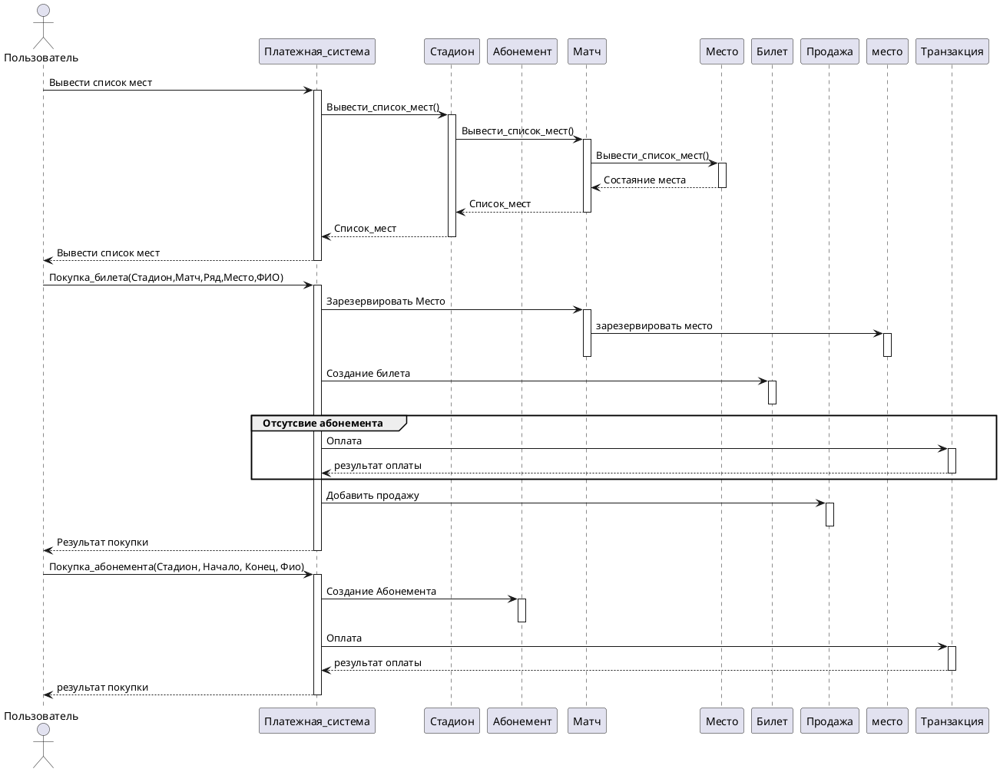

```plantuml
@startuml

actor Пользователь
participant Платежная_система
participant Стадион
participant Абонемент
participant Матч
participant Место
participant Билет
participant Продажа

Пользователь -> Платежная_система: Вывести список мест
activate Платежная_система
Платежная_система -> Стадион: Вывести_список_мест()
activate Стадион
Стадион -> Матч: Вывести_список_мест()
activate Матч
Матч -> Место: Вывести_список_мест()
activate Место
Место --> Матч: Состаяние места
deactivate Место
Матч --> Стадион: Список_мест
deactivate Матч
Стадион --> Платежная_система: Список_мест
deactivate Стадион
Платежная_система --> Пользователь: Вывести список мест
deactivate Платежная_система

Пользователь -> Платежная_система: Покупка_билета(Стадион,Матч,Ряд,Место,ФИО)
activate Платежная_система
Платежная_система -> Матч: Зарезервировать Место
activate Матч
Матч -> место : зарезервировать место
activate место
deactivate Матч
deactivate место

Платежная_система -> Билет: Создание билета
activate Билет
deactivate Билет
group Отсутсвие абонемента
Платежная_система -> Транзакция: Оплата
activate Транзакция
Транзакция --> Платежная_система: результат оплаты
deactivate Транзакция
end

Платежная_система -> Продажа: Добавить продажу
activate Продажа
deactivate Продажа
Платежная_система --> Пользователь: Результат покупки
deactivate Платежная_система

Пользователь -> Платежная_система: Покупка_абонемента(Стадион, Начало, Конец, Фио)
activate Платежная_система
Платежная_система -> Абонемент: Создание Абонемента
activate Абонемент
deactivate Абонемент
Платежная_система -> Транзакция: Оплата
activate Транзакция
Транзакция --> Платежная_система: результат оплаты
deactivate Транзакция
Платежная_система --> Пользователь: результат покупки
deactivate Платежная_система

@enduml
```