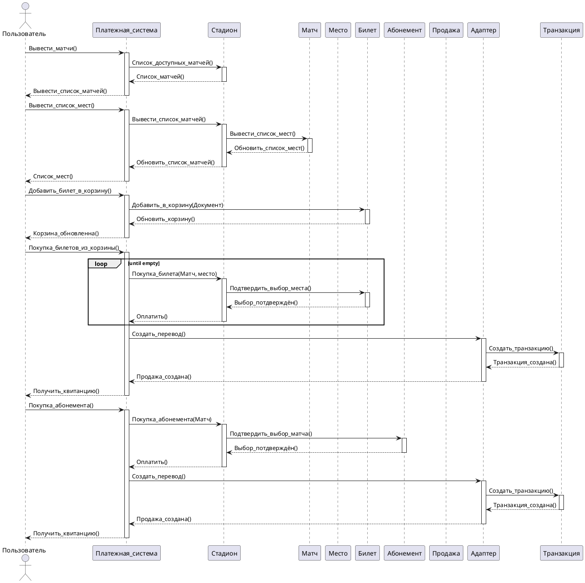

```plantuml
@startuml Диаграмма последовательности:

actor Пользователь
participant Платежная_система
participant Стадион
participant Матч
participant Место
participant Билет
participant Абонемент
participant Продажа
participant Адаптер
participant Транзакция 

'Часть с Билетом, начало.
Пользователь -> Платежная_система: Вывести_матчи()
activate Платежная_система

Платежная_система -> Стадион: Список_доступных_матчей()
activate Стадион
Стадион --> Платежная_система: Список_матчей()
deactivate Стадион
Платежная_система --> Пользователь: Вывести_список_матчей()
deactivate Платежная_система


Пользователь -> Платежная_система: Вывести_список_мест()
activate Платежная_система
Платежная_система -> Стадион: Вывести_список_матчей()
activate Стадион
Стадион -> Матч: Вывести_список_мест()
activate Матч
Матч --> Стадион: Обновить_список_мест()
deactivate Матч
Стадион --> Платежная_система: Обновить_список_матчей()
deactivate Стадион
Платежная_система --> Пользователь: Список_мест()
deactivate Платежная_система

Пользователь -> Платежная_система: Добавить_билет_в_корзину()
activate Платежная_система
Платежная_система -> Билет: Добавить_в_корзину(Документ)
activate Билет
Билет --> Платежная_система: Обновить_корзину()
deactivate Билет
Платежная_система --> Пользователь: Корзина_обновленна()
deactivate Платежная_система

Пользователь -> Платежная_система: Покупка_билетов_из_корзины()
loop until empty
    activate Платежная_система
    Платежная_система -> Стадион: Покупка_билета(Матч, место)
    activate Стадион
    Стадион -> Билет: Подтвердить_выбор_места()
    activate Билет
    Билет --> Стадион: Выбор_потдверждён()
    deactivate Билет
    Стадион --> Платежная_система: Оплатить()
    deactivate Стадион
end

Платежная_система -> Адаптер: Создать_перевод()
activate Адаптер
Адаптер -> Транзакция: Создать_транзакцию()
activate Транзакция
Транзакция --> Адаптер: Транзакция_создана()
deactivate Транзакция
Адаптер --> Платежная_система: Продажа_создана()
deactivate

Платежная_система --> Пользователь: Получить_квитанцию()
deactivate Платежная_система

'Часть с Билетом, конец.
'Часть с Абонементом, начало.

Пользователь -> Платежная_система: Покупка_абонемента()
activate Платежная_система

Платежная_система -> Стадион: Покупка_абонемента(Матч)
activate Стадион
Стадион -> Абонемент: Подтвердить_выбор_матча()
activate Абонемент
Абонемент --> Стадион: Выбор_потдверждён()
deactivate Абонемент
Стадион --> Платежная_система: Оплатить()
deactivate Стадион

Платежная_система -> Адаптер: Создать_перевод()
activate Адаптер
Адаптер -> Транзакция: Создать_транзакцию()
activate Транзакция
Транзакция --> Адаптер: Транзакция_создана()
deactivate Транзакция
Адаптер --> Платежная_система: Продажа_создана()
deactivate Адаптер

Платежная_система --> Пользователь: Получить_квитанцию()
deactivate Платежная_система

'Часть с Абонементом, конец.

@enduml

```
