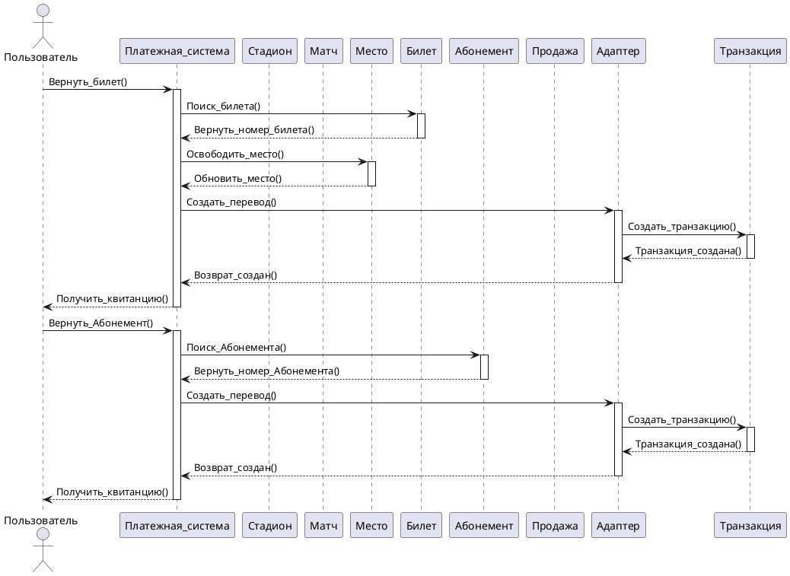

```plantuml
@startuml Диаграмма последовательности:
actor Пользователь
participant Платежная_система
participant Стадион
participant Матч
participant Место
participant Билет
participant Абонемент
participant Продажа
participant Адаптер
participant Транзакция 

Пользователь -> Платежная_система: Вернуть_билет()
activate Платежная_система
Платежная_система -> Билет: Поиск_билета()
activate Билет
Билет --> Платежная_система: Вернуть_номер_билета()
deactivate Билет
Платежная_система -> Место: Освободить_место()
activate Место
Место --> Платежная_система: Обновить_место()
deactivate Место
Платежная_система -> Адаптер: Создать_перевод()
activate Адаптер
Адаптер -> Транзакция: Создать_транзакцию()
activate Транзакция
Транзакция --> Адаптер: Транзакция_создана()
deactivate Транзакция
Адаптер --> Платежная_система: Возврат_создан()
deactivate Адаптер
Платежная_система --> Пользователь: Получить_квитанцию()
deactivate Платежная_система

Пользователь -> Платежная_система: Вернуть_Абонемент()
activate Платежная_система
Платежная_система -> Абонемент: Поиск_Абонемента()
activate Абонемент
Абонемент --> Платежная_система: Вернуть_номер_Абонемента()
deactivate Абонемент
Платежная_система -> Адаптер: Создать_перевод()
activate Адаптер
Адаптер -> Транзакция: Создать_транзакцию()
activate Транзакция
Транзакция --> Адаптер: Транзакция_создана()
deactivate Транзакция
Адаптер --> Платежная_система: Возврат_создан()
deactivate Адаптер
Платежная_система --> Пользователь: Получить_квитанцию()
deactivate Платежная_система


@enduml
```
